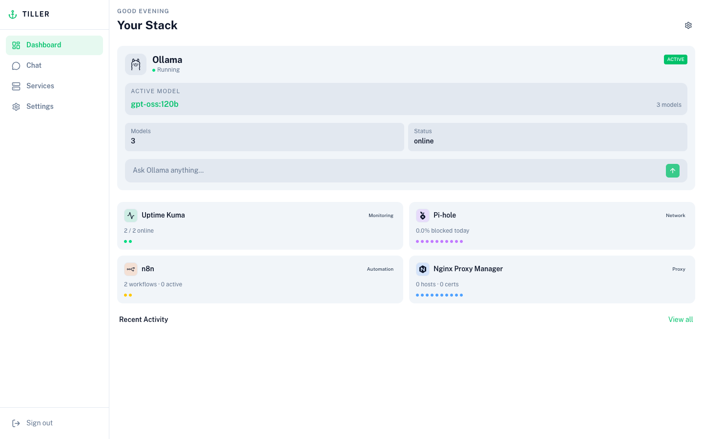
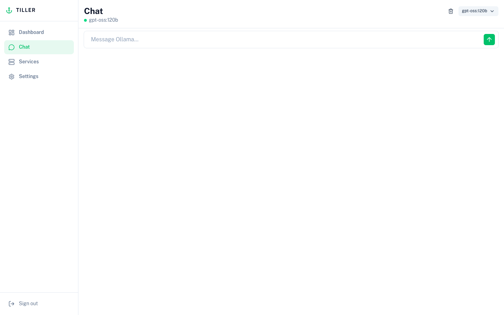
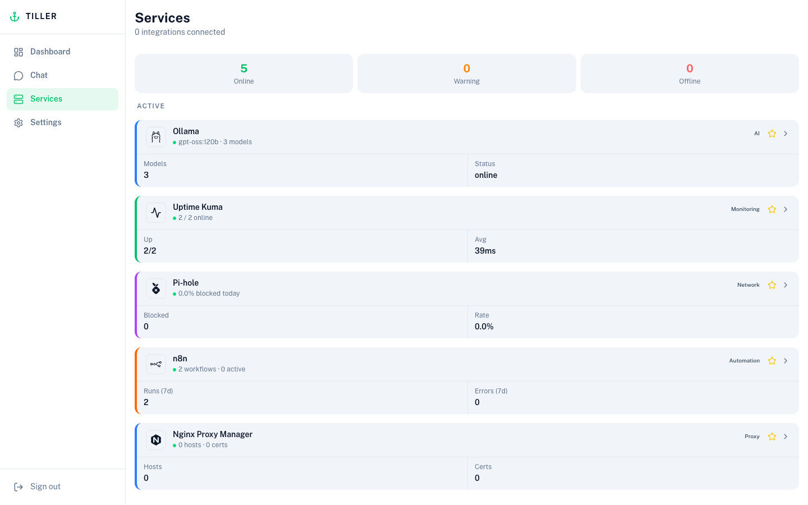
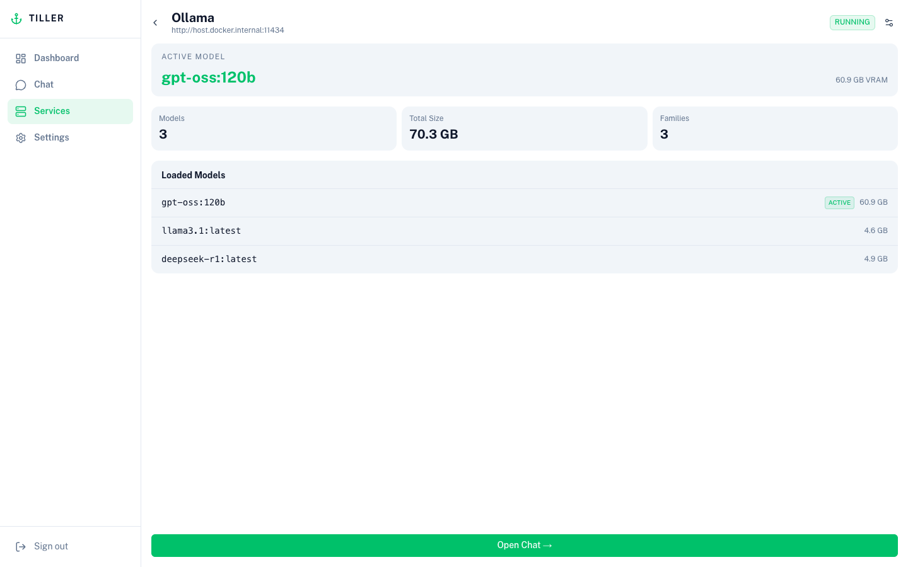
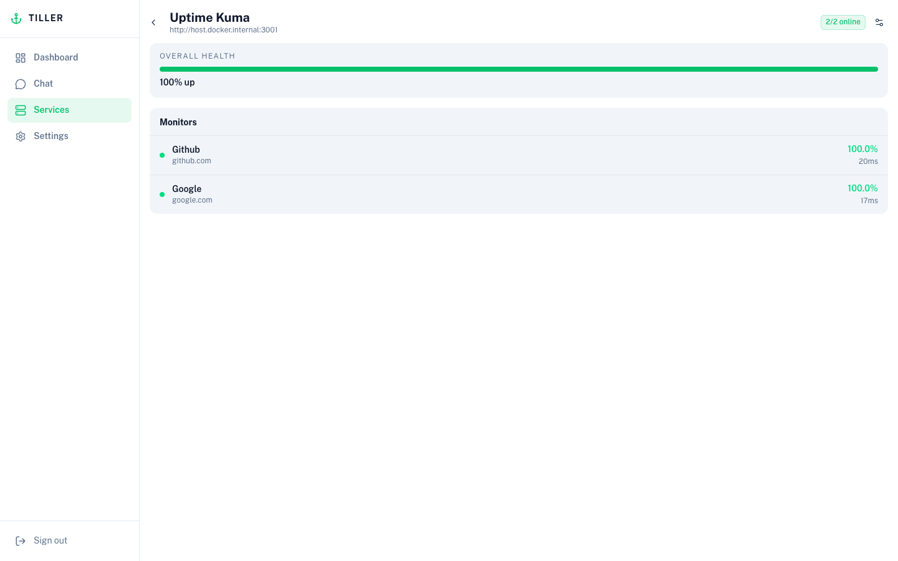
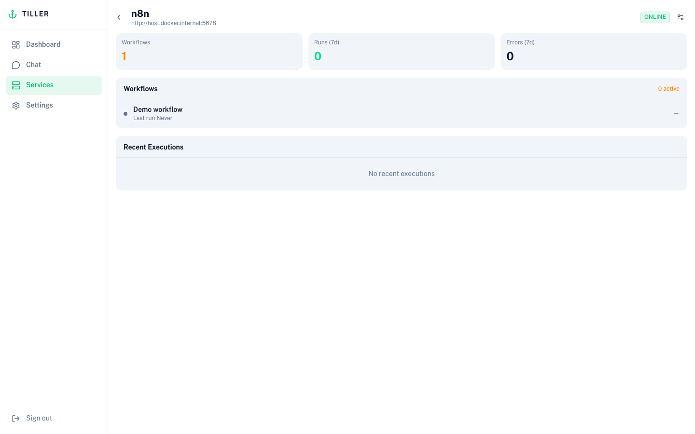
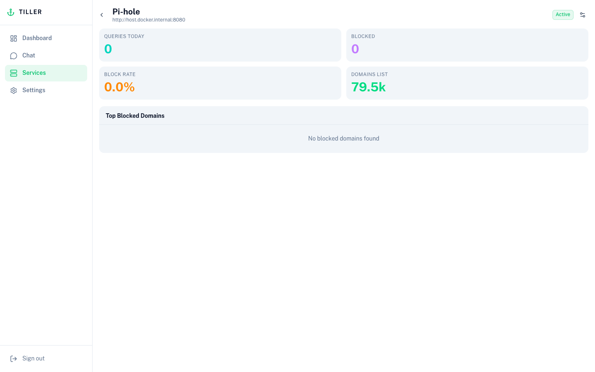
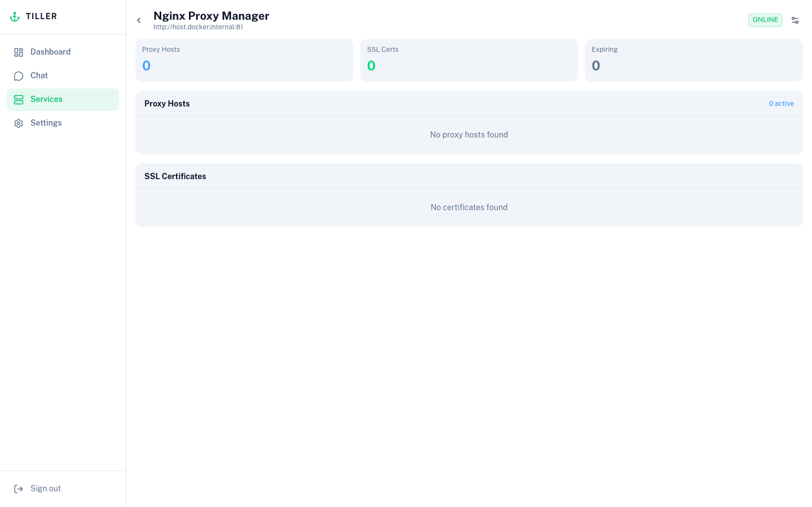
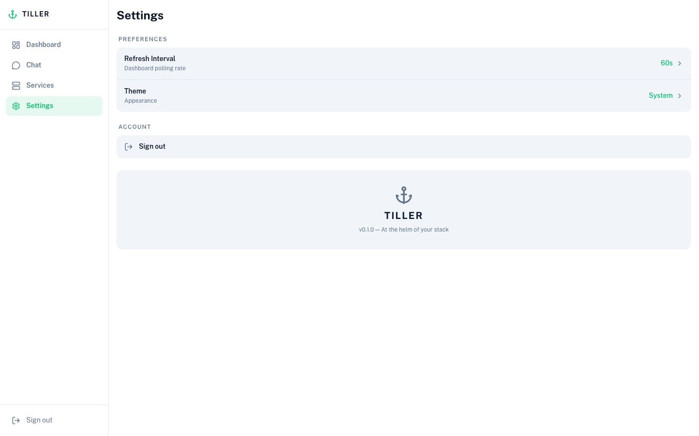

# Tiller

> At the helm of your home lab.

Tiller is a self-hosted homelab dashboard that brings all your self-hosted services together in one place. It runs as a single Docker container, requires no cloud account, and keeps your credentials on your own hardware.

[](LICENSE)
[](https://nuxt.com)
[](https://nodejs.org)

---

## Screenshots

<kbd></kbd>

<table>
  <tr>
    <td width="50%"><kbd></kbd></td>
    <td width="50%"><kbd></kbd></td>
  </tr>
  <tr>
    <td width="50%"><kbd></kbd></td>
    <td><kbd></kbd></td>
  </tr>
  <tr>
    <td><kbd></kbd></td>
    <td><kbd></kbd></td>
  </tr>
  <tr>
    <td><kbd></kbd></td>
    <td><kbd></kbd></td>
  </tr>
</table>

---

## Features

- **Unified dashboard** — live status cards for all your connected services, auto-refreshing on a configurable interval (15s / 30s / 1m / 5m)
- **Ollama chat** — streaming conversation interface with model switcher and real-time service context injected into every message
- **Single-user auth** — password setup on first run, HTTP-only session cookie; optional `TILLER_PASSWORD` env var for Docker secrets
- **UI-driven config** — integration URLs and credentials stored in SQLite, configured through the app — no env vars required
- **Server-side proxies** — all service API calls go through the Nitro server; your integration credentials never touch the browser
- **Responsive layout** — bottom tab nav on mobile, sidebar on desktop
- **Dark-first theming** — follows system preference by default, user-overridable in Settings

---

## Integrations

| Service | What Tiller shows |
|---|---|
| [Ollama](https://ollama.com) | Model list, loaded model, VRAM usage, chat interface |
| [Uptime Kuma](https://github.com/louislam/uptime-kuma) | Monitor list, uptime %, average ping |
| [Pi-hole](https://pi-hole.net) | Query stats, block rate, top blocked domains |
| [n8n](https://n8n.io) | Workflow list, execution history, error counts |
| [Nginx Proxy Manager](https://nginxproxymanager.com) | Proxy hosts, SSL certificate expiry |

More integrations are planned. See [Contributing](#contributing) to add one.

---

## Quick Start


**Requirements:** Docker and Docker Compose.

```yaml
# docker-compose.yml
services:
  tiller:
    image: ghcr.io/your-org/tiller:latest   # or: build: .
    container_name: tiller
    restart: unless-stopped
    ports:
      - "3000:3000"
    volumes:
      - tiller-data:/app/data
    environment:
      - TILLER_PASSWORD=${TILLER_PASSWORD:-}  # optional — see Configuration

volumes:
  tiller-data:
```

```bash
docker compose up -d
```

Then open [http://localhost:3000](http://localhost:3000). On first run you'll be prompted to set a password.

---

## Configuration

| Variable | Default | Description |
|---|---|---|
| `TILLER_PASSWORD` | _(none)_ | Optional. If set, this password is used directly and takes priority over any password stored in the database. If not set, you'll be prompted to create one on first run through the setup screen. |
| `TILLER_DB_PATH` | `/app/data/tiller.db` | SQLite database path inside the container. Only change this if you're not using the default volume. |

Integration URLs and API keys are **not** configured via environment variables — use the Services page in the UI instead.

---

## First Run

1. Open `http://localhost:3000` — you'll land on the setup screen.
2. Create a password. This is stored as a bcrypt hash in SQLite (or bypassed entirely if `TILLER_PASSWORD` is set).
3. Navigate to **Services** → tap **Add** on any integration and enter its URL and credentials.

That's it. Tiller starts polling immediately and your credentials stay on your server.

---

## Adding Integrations

Go to the **Services** page and click **Add** next to the service you want to connect. Each integration requires:

| Integration | Required fields |
|---|---|
| Ollama | Base URL |
| Uptime Kuma | Base URL, API Key |
| Pi-hole | Base URL, App Password |
| n8n | Base URL, API Key |
| Nginx Proxy Manager | Base URL, Email, Password |

Credentials are stored in SQLite on the server and used only for server-side proxy requests — they are never sent back to the browser after being saved.

To update credentials for an existing integration, open its detail page and tap the settings (cog) icon.

---

## Networking

### Connecting to services on the same host

When Tiller runs in Docker, `localhost` inside the container refers to the container itself — not your host machine. If your other services (Ollama, Pi-hole, etc.) are running directly on the host, use `host.docker.internal` as the hostname instead:

| Instead of | Use |
|---|---|
| `http://localhost:11434` | `http://host.docker.internal:11434` |
| `http://localhost:80` | `http://host.docker.internal:80` |

`host.docker.internal` is automatically available on Docker Desktop (macOS and Windows). On Linux, add the following to your `docker-compose.yml` under the `tiller` service:

```yaml
extra_hosts:
  - "host.docker.internal:host-gateway"
```

### Connecting to services in other Docker containers

If the service you want to connect is also running in Docker, put both containers on a shared network and use the container name as the hostname. Example:

```yaml
services:
  tiller:
    # ...
    networks:
      - homelab

  ollama:
    image: ollama/ollama
    networks:
      - homelab

networks:
  homelab:
```

Then configure the Ollama URL in Tiller as `http://ollama:11434`.

---

## Development

**Requirements:** Node 24, pnpm.

```bash
git clone https://github.com/your-org/tiller.git
cd tiller
pnpm install
cp .env.example .env    # optional: set TILLER_PASSWORD to skip the setup screen in dev
pnpm dev
```

The dev server starts at `http://localhost:3000`. Integration URLs and credentials are configured through the UI the same way as in production.

Other useful commands:

```bash
pnpm build        # Production build
pnpm preview      # Preview production build locally
pnpm lint         # ESLint
pnpm typecheck    # vue-tsc type check
pnpm db:generate  # Generate Drizzle migration files after schema changes
```

---

## Tech Stack

| Layer | Technology |
|---|---|
| Framework | [Nuxt 4](https://nuxt.com) (SPA mode + Nitro server) |
| UI | [Nuxt UI v4](https://ui.nuxt.com) + Tailwind CSS v4 |
| Database | SQLite via [Drizzle ORM](https://orm.drizzle.team) + [better-sqlite3](https://github.com/WiseLibs/better-sqlite3) |
| State | [Pinia](https://pinia.vuejs.org) |
| Icons | [Iconify](https://iconify.design) (lucide, simple-icons) |
| Runtime | Node 24 (`node:24-alpine` in Docker) |
| Language | TypeScript |

---

## Contributing

Contributions are welcome. Please open an issue before starting significant work.

### General guidelines

- Fork the repo and branch off `main`
- Run `pnpm lint && pnpm typecheck` before submitting a PR
- Keep PRs focused — one feature or fix per PR

### Adding a new integration

Adding a service requires touching four files and registering in two composables:

1. **`app/services/<name>.ts`** — pure TypeScript API client. Export a `create<Name>Service(baseUrl, ...)` factory. All requests should call `/api/proxy/<name>/...` (not the upstream URL directly).

2. **`app/stores/<name>.ts`** — Pinia store with a `refresh()` action, `status` ref (`'online' | 'offline' | 'loading' | 'unconfigured'`), and whatever data the UI needs.

3. **`server/api/proxy/<name>/[...path].ts`** — Nitro route that reads credentials from the DB and proxies requests to the upstream service. Strip `content-encoding`, `content-length`, and `transfer-encoding` response headers (Node.js auto-decompresses). Return `502` on network errors.

4. **`app/pages/services/<name>.vue`** — Detail page using the `detail` layout. Add a cog icon button that opens an `IntegrationConfigModal` for updating credentials.

5. **Register in `useServicePolling.ts`** — add `<name>Store.refresh()` to the `Promise.allSettled` call.

6. **Register in `useSystemContext.ts`** — add a `build<Name>Section(store)` function and a guarded `if` block in `buildSystemPrompt()` so the AI chat is aware of the new service.

In your PR, please describe:
- What data the integration surfaces
- What credentials/fields it requires
- A link to the service's API documentation

---

## License

[AGPL-3.0](LICENSE) — if you run a modified version as a network service, you must make your changes available under the same license.
